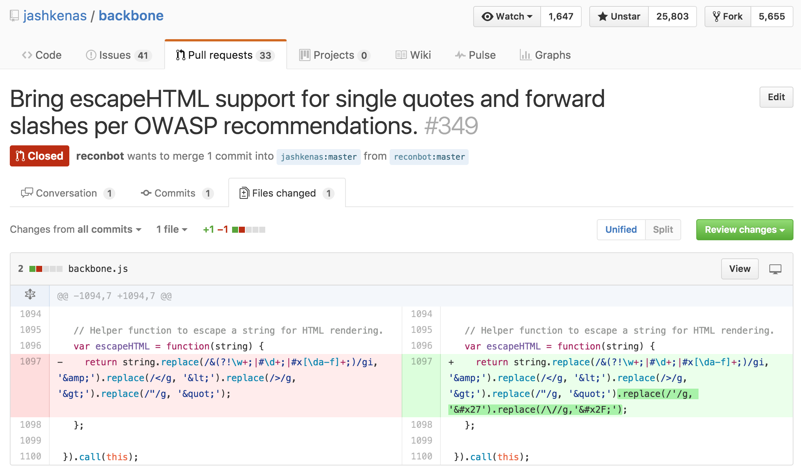
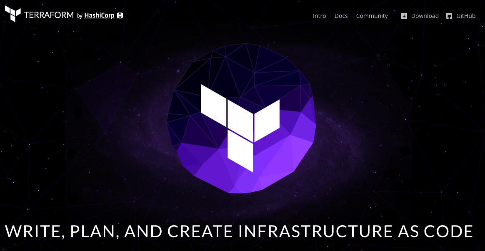

# Rough Edges
## of open source

---

You know

---

You got to

---

---

# I'm Francis
# 🚀

---

# I'm Francis
# @reconbot

---

I've been programming for at least 11 or 12

---

days

---

## I compulsively patch projects I use

---

^ Just learned about XSS

---

---

---

Not even merged

---

- Best feeling in the world
- You always know something someone else doesn't
- Fixing your bugs for other people is great

---

---

# 966!

---
# How did this start?

---

^debounce was unhelpful not like EE

---

---

6 months, 16 comments, 3 issues and 2 prs

---

---

- Somethings will be hard and you wont know why
- You get a lot done when you don't care who gets credit
- Build it yourself with failing tests or small examples

---

# node serialport

---

part 1

---

---

followed up with dozens of small tests
and bugs I found while trying to test

---

---

documentation bug reports help a lot

---

## NPM

^ When does `install` get called? What are the default values? Hidden behavior!? what?

---

### https://github.com/npm/npm/blob/master/CHANGELOG.md

^ encourages you to read the source

---

- Read the source for reality
- Tests help define behavior as much as find bugs
- Docs always drift

^ Always read the source

---

---

# TLDR
(great podcast, checkout Reply All too)

---

---

## New Tools

---

I started learning terraform

---

I am Francis
@reconbot

https://github.com/reconbot/rough-edges
