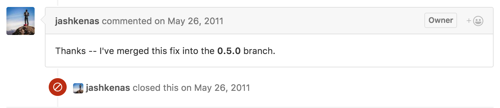
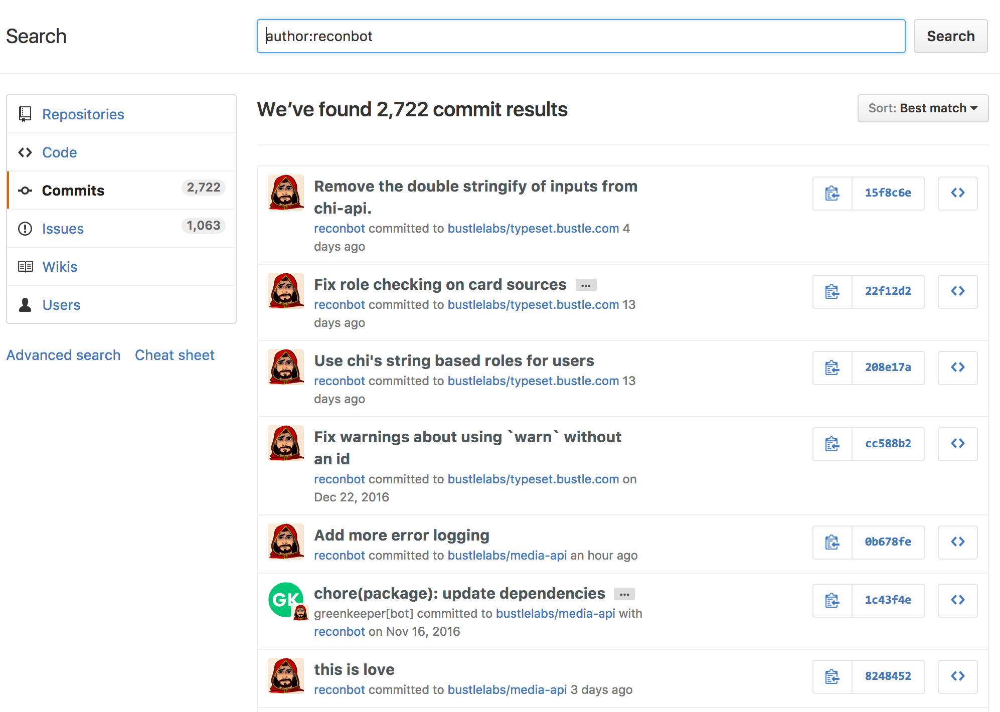
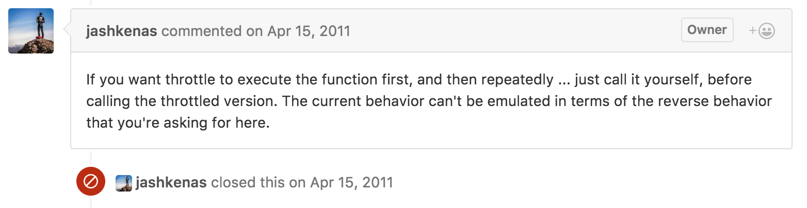
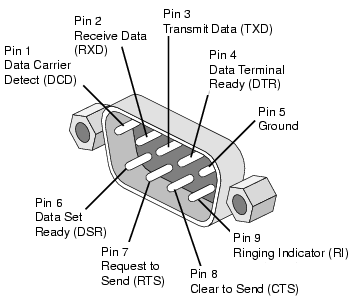

# Rough Edges
## of open source

^
Speaker notes look like this. [Rendered PDF of talk](rough-edges.pdf).
I used DeckSet to present. I wish I could export to html.

---

You know

---

You got to

---

---

# I'm Francis
# 🚀

---

# I'm Francis
# @reconbot

---

I've been programming for at least 11 or 12

---

weeks

---

I compulsively patch projects I use

^
graph made with Isometric Contributions
https://chrome.google.com/webstore/detail/isometric-contributions/mjoedlfflcchnleknnceiplgaeoegien

---

## I Think it Makes life better

---

^
So how did I start?
Just learned about XSS

---

---

---

Not even merged

---

- Best feeling in the world
- You always know something someone else doesn't
- Fixing your bugs for other people is great

---

---

---

---

# How did this start?

---

---

^debounce was unhelpful not like EE

---

^
submitted a failing test showing what I meant
Described electrical debouncing
wrote my own and walked away

---

6 months, 16 comments, 3 issues and 2 prs

---

---

- Somethings will be hard and you wont know why
- You get a lot done when you don't care who gets credit
- Build it yourself with failing tests or small examples

---

## node serialport
## (part 1)

---

^ it kept breaking johnny-five and I wanted it to stop
"Cant test this because it's hardware."

---

- followed up with dozens of small tests
- fixed bugs I found while trying to test
- given commit access(!)

^ too afraid to merge anything though

---

^ first merge of my own work

---

documentation bug reports help a lot

---

Getting eyes on your work isn't showing off

---

## NPM

^ When does `install` get called? What are the default values? Hidden behavior!? what?

---

### https://github.com/npm/npm/blob/master/CHANGELOG.md

^ encourages you to read the source
talk to maintainers

---

- Read the source for reality
- Tests help define behavior as much as find bugs
- Docs always drift

^ Always read the source

---

---

# File Bug Reports

---

---

## New Tools

---

^
wanted a docker cloud thing to host some community sites I like, docs are inconsistent and wrong a few places. I didn't write it down and I all I can say is read the source if you get lost and immediately open an issue.

---

# New Job

---

opened 8 of the last 10 issues on shep

^ 7 but I convinced someone else to open the 8th
^ half are pull requests

---

You only get beginners eyes once

---

Always file bug reports

---

# New project

^ http://1amstudios.com/2016/11/27/c64-slack-client/ runs slack and serialport!

---

## node serialport
## (part 2)

^
serialport was crashing on me so I went to see if I could fix it
open issues unanswered for 10 months
I'm now the maintainer so watch out

---

---

## oldest open issue

^ jquery.transit animation library
https://github.com/rstacruz/jquery.transit/issues/40

---

## oldest open issue

^
I made a midi parser to better understand firmata and found a bug
crashes web midi and a few other things
https://github.com/firmata/protocol/issues/1

---

- Ask questions (Respectfully)
- Help others with what you know and do triage
- If you're confused then so are others

---

# Work on tools you use

^
Shep isn't the most polished tool for lambda but it will be the best tool if you have similar needs to bustle

---

# Things I Want in Shep

- Custom builders `code => zip`

- Deterministic deploy artifacts `sha => deploy`

- Centralized Configuration for Lambda (not `shep`?)

---

# Nice first contributions

- Run Linters
- Delete stuff that's weird
- Ask questions

^
All this stuff makes for a more approachable and maintainable project

---

#Why?

^ asking you to do stuff for no reason is crazy

---

It's personal

^
I can only tell you why I do it
It teaches me new things
I get to learn about new problems
It's changed my carer
It gives me chance to work with people around the world
It's why I'm here today

---

# Projects that would love to see you

- Node-Serialport (talking to hardware of all kinds)
- Johnny-Five (JQuery for robots)
- PouchDB (JS document database)
- Shep (Manage your __lamb__da functions)

---

### http://yourfirstpr.github.io/

---

I am Francis
@reconbot
@bustlelabs

https://github.com/reconbot/rough-edges
